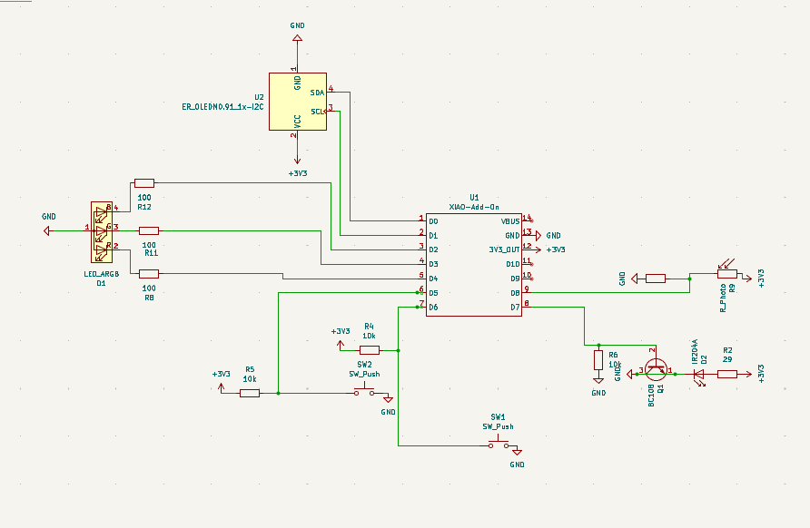
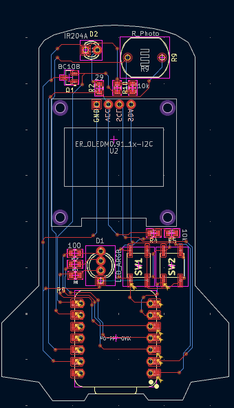
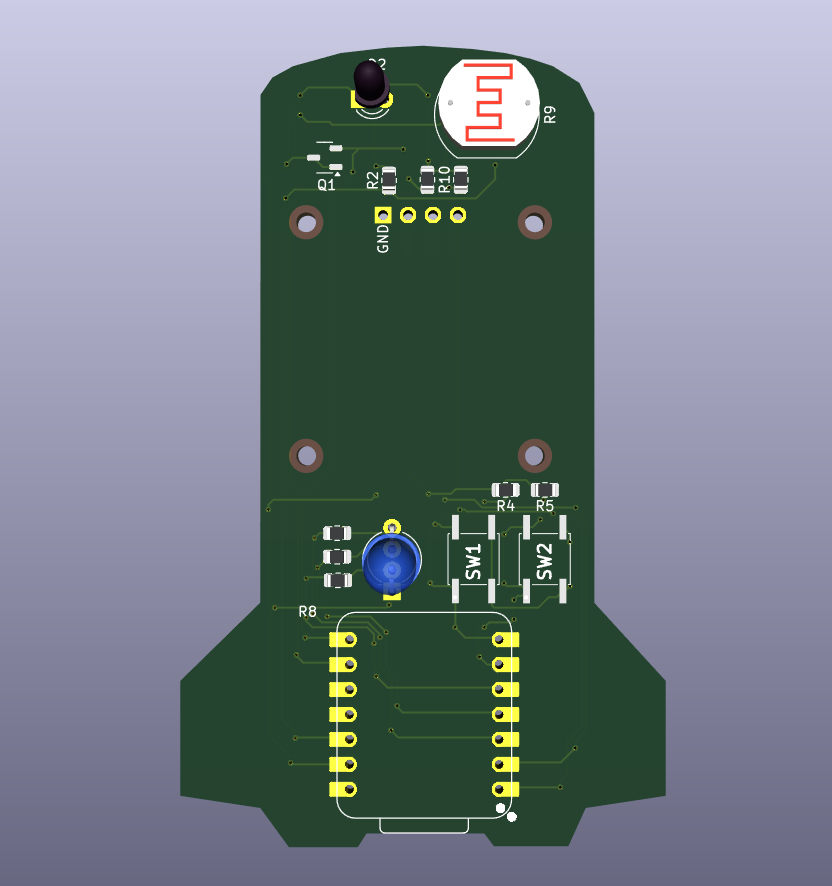

# 💣 Universal IR TV Remote — "Timer Bomb" Edition

A universal infrared remote control built around a **XIAO ESP32**, designed to automatically turn off a TV after a set countdown — or instantly, on demand.

## 📋 Overview

- ⏱️ A **30-minute timer** counts down and shows the remaining time on an OLED screen.
- 📡 When the timer hits zero, the XIAO ESP32 automatically sends an **IR POWER command** to switch off the TV.
- 🔴 A second push button lets you **turn off the TV instantly**, without waiting for the timer.
- 👁️ A **photoresistor (LDR)** checks the ambient light after the command is sent to confirm whether the TV actually turned off.
- 🟢 **Green LED** → TV detected as off.
- 🔴 **Red LED** → TV still seems to be on.
- The IR LED is driven through a **transistor** for a stronger, more reliable signal.

The PCB itself is designed and shaped like a **stick of dynamite** — a small joke: the countdown reaches zero, but instead of an explosion, the TV just switches off. 😄

## ⚙️ How It Works

1. Power on the device — the timer starts automatically at 30:00.
2. The remaining time is displayed live on the OLED screen.
3. At any point, press the **instant-off button** to send the IR power command right away.
4. Otherwise, once the timer reaches 0, the IR command is sent automatically.
5. The LDR reads the ambient brightness and lights up the green or red LED depending on whether the TV appears off.

## 🔧 Main Components

| Component | Role |
|---|---|
| **Seeed XIAO ESP32** | Main microcontroller |
| **OLED display (I2C, 0.91")** | Shows the countdown timer |
| **IR LED + transistor (BC108)** | Sends the IR POWER command |
| **Photoresistor (LDR)** | Detects TV screen brightness |
| **RGB LED** | Status indicator (TV off / TV on) |
| **2x push buttons** | Instant shutdown / control |
| **Custom PCB (KiCad)** | Bomb-shaped board hosting all components |

## 📷 Photos

**Real circuit:**

**PCB (KiCad layout):**

**3D view:**

